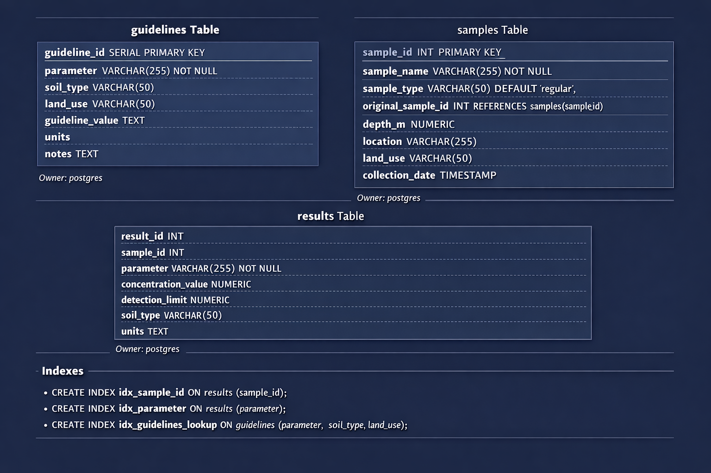

# Tier 1 Project - Soil Exceedance Analysis

## Introduction
This project analyzes soil sample results to identify exceedances based on environmental guidelines. The focus is on detecting **failures/exceedances** in soil parameters and summarizing the results for further analysis. Come check out my scripts: [Python Scripts](/py_files/__pycache__/) and [SQL Scripts](sql_files)

## Background
Soil quality assessment is critical in industrial, residential, and natural areas to ensure environmental safety. Parameters like heavy metals, pH, and other chemicals have guideline values. Exceeding these values can indicate contamination or risk areas. This project helps identify such exceedances efficiently using Python.

## Tools & Technologies
The project uses the following tools:
- **Python** for data processing, analysis, and reporting
- **SQL** for database schema design and data management
- **PostgreSQL** as the relational database engine
- **Camelot** for extracting guideline tables from PDF documents
- **Pandas** for dataframe manipulation and dataset merging
- **Seaborn & Matplotlib** for visualization (heatmaps and summary plots)
- **Git** for version control
- **CSV files** for storing and sharing processed results

## The Analysis
1. **Creating the Database**:

*Database schema showing the structure and relationships between the samples, results, and guidelines tables used for soil data analysis; ChatGPT generated this imagine from my SQL queries*

1. **Data Input**: 
Guideline Data Extraction & Processing

- To populate the database with regulatory guideline values, Alberta Tier 1 Soil Guidelines were sourced directly from the official PDF document. Because the guidelines are published in a tabular PDF format, a custom extraction and cleaning workflow was required.

**PDF Table Extraction:**

- The script uses Camelot to extract soil guideline tables from the PDF:

- Specific pages containing soil guidelines are targeted.

- The lattice extraction method is used, due to grid-based tables.

- Needed to convert each PDF table into a Pandas DataFrame for further processing.

```python
import camelot
import pandas as pd
import re
import matplotlib.pyplot as plt


PDF_PATH = "/Applications/PostgreSQL 18/Developer/Tier_1_Project/pdf_file/albertatier1guidelines.pdf"
OUTPUT_CSV = "/Applications/PostgreSQL 18/Developer/Tier_1_Project/csv_files/alberta_tier1_soil_guidelines.csv"


# 1. Extract tables using Camelot
tables = camelot.read_pdf(
    PDF_PATH,
    pages="43-48",          
    flavor="lattice"
)
#camelot.plot(tables[0], kind='contour')
#plt.show()
rows = []

def split_vertical(cell):
    if not isinstance(cell, str):
        return []
            
    # 1. Remove commas inside numbers
    cell = re.sub(r"(?<=\d),(?=\d)", "", cell)  # "2,000" -> "2000"

    # 2. Split on newlines
    return [
        v.strip()
        for v in cell.split("\n")
        if v.strip() and v not in ["-", ".", "—"]
    ]


# 2. Process each table
for table in tables:
    df = table.df

    # Drop header rows (first 3 rows are always headers)
    df = df.iloc[3:].reset_index(drop=True)
    #print(df.head(35))

    
    
    last_notes = ""  # store last non-empty notes

    #iterating through the table
    for _, row in df.iterrows():
        #parameter = row[0].strip()

        #if not parameter:
        #    continue

        land_uses = [
            "Natural Area", "Agricultural",
            "Residential/Parkland", "Commercial", "Industrial"
        ]
   
# --- EXCEPTION: all numbers crammed into row[0] ---
        # inside the loop
        if row[1].strip() == "" and row[2].strip() == "" and row[3].strip() == "":
            parts = [p.strip() for p in row[0].split("\n") if p.strip()]
            param_name = parts[0]
            fine_values = parts[1:6]
            coarse_values = parts[6:11]
            notes_value = parts[11] if len(parts) > 11 else ""
        else:
            param_name = row[0].strip()
            fine_values = split_vertical(row[1])
            coarse_values = split_vertical(row[2])
            notes_value = row[3].strip() if isinstance(row[3], str) and row[3].strip() else ""


        #If Notes exists, it gets assigned.
        #If Notes is empty, notes_value is "".
        #Both Fine and Coarse rows use the same notes_value from that row, and it won’t carry over from previous rows.
        notes_value = row[3].strip() if isinstance(row[3], str) and row[3].strip() else ""
        #print(f"'{notes_value}'")  # quotes will show empty strings
       

        #fine_values = split_vertical(row[1])

        # Fine soil
        for value, land_use in zip(fine_values, land_uses):
            if value:
                rows.append({
                    "parameter": param_name,
                    "soil_type": "Fine",
                    "land_use": land_use,
                    "guideline_value": value,
                    "units": "mg/kg",
                    "notes": notes_value
                })

        #coarse_cols = split_vertical(row[2])
        # Coarse soil
        for value, land_use in zip(coarse_values, land_uses):
            if value:
                rows.append({
                    "parameter": param_name,
                    "soil_type": "Coarse",
                    "land_use": land_use,
                    "guideline_value": value,
                    "units": "mg/kg",
                    "notes": notes_value
                })

# 3. Create final DataFrame
clean_df = pd.DataFrame(rows)

# Clean text artifacts
clean_df = clean_df.applymap(
    lambda x: x.replace("\n", " ").strip() if isinstance(x, str) else x
)

# 4. Save CSV
clean_df.to_csv(OUTPUT_CSV, index=False)

print(f"Done! Saved to {OUTPUT_CSV}")
```

After extracting and structuring the guideline data, the database was populated with guideline values, sample metadata, and analytical results. Sample and result data were generated using ChatGPT to simulate realistic environmental datasets for development and testing.

The datasets were uploaded into PostgreSQL and loaded into Pandas DataFrames for analysis. Sample data was joined to analytical results using unique sample identifiers, and guideline values were matched based on parameter, soil type, and land use. Basic data standardization was applied to ensure reliable joins.

This allows for samples to be evaluated based on guidelines. 

2. **Exceedance Calculation**: Each sample is checked against its relevant guideline to determine if it fails.

**The script performs the following:**

- Merges analytical results with sample data to include land use information.

- Joins results with guideline values based on parameter, soil type, and land use.

- Parses numeric guideline values, handling both single value and range based guidelines.

- Extracts minimum and maximum limits for parameters such as pH, which uses a range.

- For pH, checks whether sample concentrations fall outside the guideline range.

- For all other parameters, flags samples exceeding the maximum guideline value.

- Returns a DataFrame of only the failed samples.

- Includes key information: sample ID, name, parameter, soil type, land use, measured value, and guideline value.


```python
import pandas as pd

def calculate_exceedances(df_results, df_samples, df_guidelines):
    # Merge land use from samples
    df = df_results.merge(
        df_samples[['sample_id', 'sample_name', 'land_use']],
        on='sample_id',
        how='left'
    )

    # Standardize strings for matching
    for col in ['parameter', 'soil_type', 'land_use']:
        df[col] = df[col].str.strip().str.lower()
        df_guidelines[col] = df_guidelines[col].str.strip().str.lower()

    # Merge with guidelines
    df = df.merge(
        df_guidelines,
        on=['parameter', 'soil_type', 'land_use'],
        how='left'
    )

    # Parse guideline values
    def parse_guideline_value(value):
        if pd.isna(value):
            return None, None
        value = str(value).strip()
        if '-' in value:
            try:
                min_val, max_val = value.split('-')
                return float(min_val), float(max_val)
            except:
                return None, None
        try:
            return None, float(value)
        except:
            return None, None

    df[['guideline_min', 'guideline_max']] = (
        df['guideline_value'].apply(parse_guideline_value).apply(pd.Series)
    )

    # Exceedance flag
    df['exceeds'] = False

    # Range based for pH
    ph_mask = df['parameter'] == 'pH (in 0.01m cacl2)'
    df.loc[ph_mask, 'exceeds'] = (
        (df.loc[ph_mask, 'concentration_value'] < df.loc[ph_mask, 'guideline_min']) |
        (df.loc[ph_mask, 'concentration_value'] > df.loc[ph_mask, 'guideline_max'])
    )

    # Max only for everything else
    df.loc[~ph_mask, 'exceeds'] = df.loc[~ph_mask, 'concentration_value'] > df.loc[~ph_mask, 'guideline_max']

    # Keep only relevant info for exceeded samples
    df_exceeded = df[df['exceeds']].copy()
    df_exceeded = df_exceeded[[
        'sample_id', 'sample_name', 'parameter', 'soil_type', 'land_use',
        'concentration_value', 'guideline_value', 'exceeds'
    ]]

    return df_exceeded
```
**Output**:
| sample_id | sample_name | parameter | soil_type | land_use    | concentration_value | guideline_value | exceeds |
|-----------|-------------|-----------|-----------|------------|------------------|----------------|---------|
| 1         | BH26-01     | benzene   | coarse    | industrial | 7.38             | 0.078          | True    |
| 2         | BH26-02     | benzene   | fine      | industrial | 41.53            | 0.046          | True    |
| 3         | BH26-03     | cadmium   | coarse    | agricultural | 13.74          | 1.4            | True    |
| 3         | BH26-03     | benzene   | coarse    | agricultural | 42.84          | 0.073          | True    |
| 4         | BH26-04     | cadmium   | coarse    | industrial | 24.42            | 22             | True    |
| 4         | BH26-04     | benzene   | coarse    | industrial | 9.09             | 0.078          | True    |
| 5         | BH26-05     | cadmium   | coarse    | agricultural | 37.45          | 1.4            | True    |


## What I Learned
- How to merge multiple datasets (samples, results, guidelines) for analysis.
- How to calculate exceedances using conditional logic.
- How to summarize and visualize complex datasets in Python.


## Future Plans
- Add **pass/fail reporting** to include passing samples for completeness and improved reporting clarity.
- Expand the analysis to include **temporal trends**, allowing exceedances to be evaluated over time using sample collection dates.
- Implement **QA/QC checks**, including:
  - Duplicate sample precision analysis (e.g., Relative Percent Difference).
  - Evaluation of field, trip, and equipment blanks for potential contamination.
  - Detection limit and non-detect handling to avoid false exceedances.
  - Unit consistency validation between analytical results and guideline values.
- Introduce **statistical summaries** (e.g., min, max, mean, median) to support data interpretation.
- Improve **automation and reproducibility** through configuration files and logging.
- Potentially integrate a **dashboard or reporting interface** for easier visualization and exploration of exceedance results.


## Conclusion
This project demonstrates a reproducible workflow for identifying soil parameter exceedances, summarizing results, and visualizing risk areas. The tools and methods used allow for rapid analysis and provide clear insight into high-risk locations and parameters.
